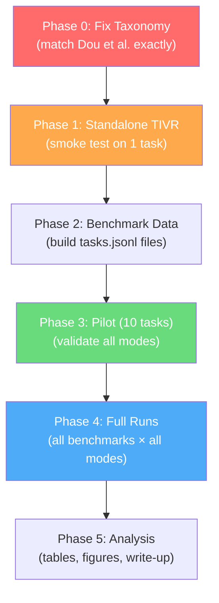

# TIVR Implementation Plan
## Taxonomy-guided Iterative Verification and Repair

> Extending Dou et al. (Sci China Inf Sci, 2026) — *"What is wrong with your code generated by large language models?"*

---

## Thesis in One Sentence

> *Replace Dou et al.'s LLM self-critique with machine-verified, taxonomy-grounded, evidence-backed feedback — same single agent, same 2-iteration budget — and measure the improvement in Repair Success Rate.*

---

## Phase 0 — Taxonomy Alignment (Critical Pre-requisite)

> [!CAUTION]
> The DESIGN.md itself warns: **"Before any experiment, open Dou et al.'s taxonomy figure and replace the primary/secondary strings with the paper's EXACT wording."** This is mandatory — your paper claims to use *their* taxonomy.

### Dou et al.'s Exact Taxonomy (from Figure 3, Section 4.1)

The paper defines **3 primary** and **10 secondary** bug types. Here is the exact mapping from the paper to our TIVR IDs:

| TIVR ID | Dou Primary | Dou Secondary (exact paper wording) | Current `taxonomy.py` | Status |
|---------|-------------|--------------------------------------|----------------------|--------|
| S1 | **Type A: Syntax Bug** | **A.1 Incomplete syntax structure** | "Syntax rule violation" | ❌ Needs fix |
| S2 | **Type A: Syntax Bug** | **A.2 Incorrect indentation** | "Incomplete generation" | ❌ Needs fix |
| — | **Type A: Syntax Bug** | **A.3 Library import error** | *Not mapped* | ❌ Missing |
| R1 | **Type B: Runtime Bug** | **B.2 Definition missing** | "Undefined name / reference" | ⚠️ Close but not exact |
| R2 | **Type B: Runtime Bug** | **B.1 API misuse** | "API misuse / hallucinated API" | ⚠️ Close |
| R3 | **Type B: Runtime Bug** | **B.4 Incorrect argument** | "Type mismatch" | ❌ Needs fix |
| R4 | **Type B: Runtime Bug** | **B.3 Incorrect boundary condition check** | "Invalid value / index / key" | ❌ Needs fix |
| — | **Type B: Runtime Bug** | **B.5 Minors** (timeout, LLM-defined exceptions) | *Partially mapped to F4* | ⚠️ |
| F1 | **Type C: Functional Bug** | **C.1 Misunderstanding and logic error** | "Misunderstood requirement" | ⚠️ Close |
| F2 | **Type C: Functional Bug** | **C.2 Hallucination** | "Logic error" | ❌ Wrong mapping |
| F3 | **Type C: Functional Bug** | **C.3 Input/output format error** | "Missing edge case" | ❌ Wrong mapping |
| F4 | **Type C: Functional Bug** | **C.4 Minors** (incorrect init, sub-optimal, infinite loop) | "Performance / non-termination" | ⚠️ Partial |

> [!IMPORTANT]
> **Key discovery:** The current `taxonomy.py` has several incorrect mappings. For example, TIVR's "F2" maps to "Logic error" but Dou's C.2 is actually "Hallucination". The DESIGN.md's taxonomy was a best-effort reconstruction — it needs to be corrected to match the paper exactly.

### Corrected Taxonomy Mapping

| New TIVR ID | Dou ID | Primary | Secondary | Signal Mapping |
|-------------|--------|---------|-----------|----------------|
| A1 | A.1 | Syntax Bug | Incomplete syntax structure | `SyntaxError:truncated`, unclosed brackets/quotes |
| A2 | A.2 | Syntax Bug | Incorrect indentation | `IndentationError`, `TabError` |
| A3 | A.3 | Syntax Bug | Library import error | `SyntaxError` from `import *` inside function body etc. |
| B1 | B.1 | Runtime Bug | API misuse | `AttributeError`, `TypeError` on API calls |
| B2 | B.2 | Runtime Bug | Definition missing | `NameError`, `UnboundLocalError` |
| B3 | B.3 | Runtime Bug | Incorrect boundary condition check | `ZeroDivisionError`, `IndexError`, `KeyError` on bounds |
| B4 | B.4 | Runtime Bug | Incorrect argument | Wrong number/type of function arguments |
| B5 | B.5 | Runtime Bug | Minors | Timeout errors, LLM-defined exceptions |
| C1 | C.1 | Functional Bug | Misunderstanding and logic error | `AssertionError` + majority of tests fail |
| C2 | C.2 | Functional Bug | Hallucination | Code structurally unrelated to task |
| C3 | C.3 | Functional Bug | Input/output format error | Wrong output precision/order |
| C4 | C.4 | Functional Bug | Minors | Incorrect initialization, sub-optimal algorithm, infinite loop |

### Tasks
- [ ] **P0-1**: Rewrite `TAXONOMY` dict in [taxonomy.py](file:///d:/Desktop/MACI/files/taxonomy.py) with exact Dou et al. strings
- [ ] **P0-2**: Add missing categories (A.2 Incorrect indentation, A.3 Library import error, B.4 Incorrect argument, B.5 Minors, C.2 Hallucination, C.3 I/O format error, C.4 Minors)
- [ ] **P0-3**: Update `_rules()` mapping functions to correctly route signals to the new IDs
- [ ] **P0-4**: Update `PRIORITY` ordering to match the paper's severity hierarchy
- [ ] **P0-5**: Update `repair_hint` strings to be category-specific and actionable

---

## Phase 1 — Foundation: Get TIVR Running Standalone

**Goal:** Run the full pipeline end-to-end on a single hand-crafted buggy snippet.

### 1.1 Project Structure Setup
- [ ] **P1-1**: Create a proper Python package at `d:\Desktop\MACI\tivr\` with `__init__.py`
- [ ] **P1-2**: Move/copy the corrected modules from `files/` into `tivr/`:
  ```
  tivr/
  ├── __init__.py
  ├── schemas.py
  ├── verifier.py
  ├── taxonomy.py
  ├── feedback.py
  ├── repair_loop.py
  ├── run_benchmark.py
  └── tests/
      ├── __init__.py
      └── test_smoke.py
  ```
- [ ] **P1-3**: Create `requirements.txt` with dependencies: `radon`, `mypy`, `pytest`, `semgrep` (optional)
- [ ] **P1-4**: Fix imports in all modules to use package-relative imports (`from tivr.schemas import ...` or relative `from .schemas import ...`)

### 1.2 Verifier Smoke Tests
- [ ] **P1-5**: Create `tests/test_smoke.py` with hand-crafted buggy snippets covering each bug type:
  - A.1: Unclosed parenthesis → `SyntaxError`
  - A.2: Wrong indentation → `IndentationError`
  - A.3: `from heapq import *` inside a function
  - B.1: `tup.sort()` on a tuple → `AttributeError`
  - B.2: Undefined variable `MOD`
  - B.3: `n % length` where `length = 0` → `ZeroDivisionError`
  - B.4: Function called with wrong number of args
  - C.1: Logic error (integer concatenation vs addition — the paper's exact example)
- [ ] **P1-6**: Run the `Verifier` on each snippet and verify it produces the correct `Finding` with the correct `taxonomy_id`
- [ ] **P1-7**: Verify the `VerificationReport` JSON output matches the format in DESIGN.md §5

### 1.3 LLM Client Validation
- [ ] **P1-8**: Set up `.env` with `TIVR_API_BASE`, `TIVR_API_KEY`, `TIVR_MODEL` (start with DeepSeek-chat — cheapest)
- [ ] **P1-9**: Test `LLMClient.chat()` with a simple prompt
- [ ] **P1-10**: Test `compose_generation_prompt()` → LLM → `extract_code()` pipeline

### Checkpoint ✅
> Run `python -m tivr.run_benchmark test_tasks.jsonl --k 2 --mode full --limit 1` on a single hand-crafted task. Inspect `runs/trajectories.jsonl`. Does it contain: generation → verification → taxonomy diagnosis → repair prompt → re-verification? If yes, Phase 1 is complete.

---

## Phase 2 — Benchmark Data Preparation

**Goal:** Build `tasks.jsonl` files for the three benchmarks.

### 2.1 HumanEval+ (164 tasks)
- [ ] **P2-1**: `pip install evalplus`
- [ ] **P2-2**: Write a script `tivr/scripts/prepare_humaneval.py` that:
  - Dumps each HumanEval+ problem's prompt/docstring
  - Splits tests: docstring examples → `visible_tests`, EvalPlus-extended suite → `hidden_tests`
  - Outputs `data/humaneval_plus.jsonl`
- [ ] **P2-3**: Validate: load 3 tasks, run visible tests against canonical solution → all should pass

### 2.2 MBPP+ (399 tasks)
- [ ] **P2-4**: Same script pattern → `data/mbpp_plus.jsonl`
- [ ] **P2-5**: Validate same way

### 2.3 RWPB (140 tasks) — from Dou et al.'s artifact
- [ ] **P2-6**: Download from Dou's artifact repo: `https://github.com/LLMCodeGenerationStudy/LLMCodeGenerationStudy`
- [ ] **P2-7**: Write `tivr/scripts/prepare_rwpb.py` to convert their format into our `tasks.jsonl` schema
- [ ] **P2-8**: Determine how Dou split visible vs hidden tests (check their paper Section 6 — they used compiler feedback, which means they ran the code against tests). Mirror their split exactly for head-to-head fairness.

### Checkpoint ✅
> Three `.jsonl` files exist in `data/`. Each task has `task_id`, `prompt`, `visible_tests`, `hidden_tests`. Running `wc -l` confirms expected counts (164, 399, 140).

---

## Phase 3 — Pilot Experiments (10-task runs)

**Goal:** Validate the full pipeline on a small subset before committing to full runs.

### 3.1 Pilot Run
- [ ] **P3-1**: Run `python -m tivr.run_benchmark data/humaneval_plus.jsonl --k 2 --mode full --limit 10`
- [ ] **P3-2**: Inspect `runs/trajectories.jsonl`:
  - Are repair prompts well-formed?
  - Do diagnoses map to correct Dou categories?
  - Is evidence properly trimmed (≤20 lines)?
  - Does the lesson memory carry forward correctly?
- [ ] **P3-3**: Run the same 10 tasks with each ablation mode:
  - `--mode generic` (B1: Self-Debug-style)
  - `--mode taxonomy_only` (B2: ≈ Dou's approach)
  - `--mode evidence_only` (A1: ablation)
  - `--mode full` (OURS)
- [ ] **P3-4**: Compare repair success rates across modes — even on 10 tasks, OURS should trend higher

### 3.2 Fix Issues
- [ ] **P3-5**: Fix any taxonomy mapping errors discovered during inspection
- [ ] **P3-6**: Fix any prompt formatting issues
- [ ] **P3-7**: Tune `MAX_FINDINGS_PER_STAGE` and `EVIDENCE_MAX_LINES` if needed

### Checkpoint ✅
> All 4 modes produce valid `summary_*.json` files. No crashes, no malformed prompts. Trajectories are inspectable and make sense.

---

## Phase 4 — Full Experiment Runs

**Goal:** Produce the paper's main results table.

### 4.1 Model Selection
The paper uses GPT-4 for their 29.2% RSR claim. For our experiments:
- [ ] **P4-1**: **Primary model**: DeepSeek-chat (cheap, OpenAI-compatible API) — this is the minimum
- [ ] **P4-2**: **If budget allows**: GPT-4o-mini or GPT-4 (for direct head-to-head with Dou's 29.2%)
- [ ] **P4-3**: **If time allows**: Qwen2.5-Coder via Ollama (free, local) — shows model-agnosticism

### 4.2 Run Matrix

| Run ID | Benchmark | Mode | k | Model | Est. Cost |
|--------|-----------|------|---|-------|-----------|
| R1 | HumanEval+ (164) | full | 2 | DeepSeek-chat | ~$2 |
| R2 | HumanEval+ (164) | generic | 2 | DeepSeek-chat | ~$2 |
| R3 | HumanEval+ (164) | taxonomy_only | 2 | DeepSeek-chat | ~$2 |
| R4 | HumanEval+ (164) | evidence_only | 2 | DeepSeek-chat | ~$2 |
| R5 | MBPP+ (399) | full | 2 | DeepSeek-chat | ~$5 |
| R6 | MBPP+ (399) | generic | 2 | DeepSeek-chat | ~$5 |
| R7 | RWPB (140) | full | 2 | DeepSeek-chat | ~$2 |
| R8 | RWPB (140) | generic | 2 | DeepSeek-chat | ~$2 |

- [ ] **P4-4**: Run all experiments (can be parallelized with different `--out` dirs)
- [ ] **P4-5**: For each run, verify `summary_*.json` is complete with all metrics
- [ ] **P4-6**: Run the B0 (no repair, k=0) baseline for each benchmark

### 4.3 Key Metrics to Extract

From `summary_*.json`:
```
pass@1_before_repair    — baseline code quality
pass@1_after_repair     — after TIVR repair
repair_success_rate     — THE Dou comparator (their GPT-4 @ k=2 = 29.2%)
per_category_repair_rate — per-cell comparison with Dou
total_llm_calls         — cost efficiency
total_prompt_tokens     — cost efficiency
```

### Checkpoint ✅
> At minimum: R1-R4 complete. `summary_full_k2.json` shows RSR > `summary_generic_k2.json` and RSR > `summary_taxonomy_only_k2.json`. This proves the thesis.

---

## Phase 5 — Analysis & Paper Content

**Goal:** Transform raw results into paper-ready tables, figures, and analysis.

### 5.1 Results Tables

- [ ] **P5-1**: **Table 1 (Main results)**: Ablation grid — columns = modes (B0, B1/generic, B2/taxonomy_only, A1/evidence_only, OURS/full), rows = benchmarks, cells = RSR
- [ ] **P5-2**: **Table 2 (Per-category RSR)**: Rows = Dou taxonomy categories (A.1–C.4), columns = modes. Compare cell-by-cell with Dou's Table 3/4.
- [ ] **P5-3**: **Table 3 (Cost)**: LLM calls, prompt tokens, completion tokens per solved task — shows TIVR is cheaper than multi-agent alternatives
- [ ] **P5-4**: **Table 4 (Bug evolution)**: Track how bugs transition across iterations (like Dou's Figure 7)

### 5.2 Qualitative Analysis

- [ ] **P5-5**: Read 10–15 trajectories from `trajectories.jsonl` and write case studies:
  - A case where taxonomy mapping led to correct repair
  - A case where evidence (not taxonomy) was the decisive factor
  - A failure case where TIVR couldn't repair (and why)
- [ ] **P5-6**: Extract the most common diagnosis categories and analyze if certain categories are harder to repair

### 5.3 Threats to Validity

From DESIGN.md §12:
- [ ] **P5-7**: Rule-based mapper vs LLM classifier trade-off (state as limitation)
- [ ] **P5-8**: Visible-test dependence (CodeT v2 upgrade path)
- [ ] **P5-9**: Report mapper confusion against 30-sample manual labeling
- [ ] **P5-10**: Declare any deviation from Dou's repair-prompt information content

### Checkpoint ✅
> Paper has: abstract, introduction, methodology (architecture + TIVR pipeline), experimental setup (benchmarks + ablation grid), results (tables 1–4), analysis (case studies), threats, conclusion.

---

## Summary: Critical Path



> [!TIP]
> **Start with Phase 0.** The taxonomy correction is the single most important task — everything downstream (mapping rules, repair hints, per-category analysis) depends on it being exactly right. It's a 30–60 minute task.

---

## Ready to start?

Tell me which phase to begin implementing. I recommend starting with **Phase 0 + Phase 1** together — fix the taxonomy and get the pipeline running on a single test case.
